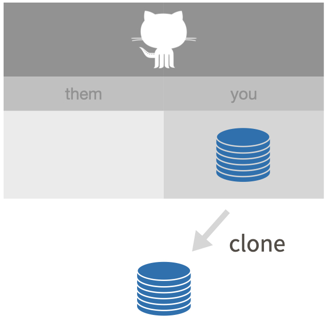

```{r}
#| echo = FALSE, fig.align = "center", out.width = "60%",
#| fig.alt = "Clone a remote repo."

```

Les presento dos formas de hacer esto:

-   `usethis::create_from_github()`
-   A través del IDE de RStudio

*(Recuerde que mostramos cómo hacer esto con la línea de comando Git en @sec-push-pull-github.)*

Cuando clonas tu propio repositorio de GitHub, los dos métodos son equivalentes. En otros escenarios, especialmente fork-and-clone (@secfork-and-clone), creo que `usethis::create_from_github()` es superior, porque realiza una configuración adicional recomendada.

Elija **uno** de estos métodos a continuación.

### `usethis::create_from_github()`

Puede ejecutar este comando en cualquier sesión de R. Si usa RStudio, hágalo en la consola R de cualquier instancia de RStudio.

```{r eval = FALSE}
usethis::create_from_github(
  "https://github.com/YOU/YOUR_REPO.git",
  destdir = "~/path/to/where/you/want/the/local/repo/"
)
```

El primer argumento es `repo_spec` y acepta la especificación del repositorio de GitHub en varias formas. En particular, puedes usar la URL que acabamos de copiar de GitHub.

El argumento `destdir` especifica el directorio principal donde desea que resida la nueva carpeta (y el repositorio local de Git). Si no especifica `destdir`, use este valor predeterminado en algún lugar muy visible, como su escritorio. Si desea mantener los repositorios de Git en una determinada carpeta de su computadora, puede personalizar este valor predeterminado configurando la opción `usethis.destdir` en su `.Rprofile`.

Aceptamos el comportamiento predeterminado de otros dos argumentos, `rstudio` y `open`, porque eso es lo que la mayoría de la gente querrá. Por ejemplo, para un usuario de RStudio, `create_from_github()` hace esto:

-   Crea un nuevo directorio local en `destdir`, que contiene todas estas cosas:
    -   un directorio o carpeta en su computadora
    -   un repositorio Git, vinculado a un repositorio GitHub remoto
    -   un proyecto RStudio
-   Abre una nueva instancia de RStudio en el nuevo Proyecto.
-   **En ausencia de otras restricciones, sugiero que todos sus proyectos de R tengan exactamente esta configuración.**

### RStudio IDE

En RStudio, inicie un nuevo proyecto:

-   *File \> New Project \> Version Control \> Git*. En la "URL del repositorio", pegue la URL de su nuevo repositorio de GitHub. será algo como esto `https://github.com/jennybc/myrepo.git`.
-   Sea intencional acerca de dónde crea este proyecto.
-   Te sugiero "Abrir en nueva sesión".
-   Haga clic en "Crear proyecto" para crear un nuevo directorio, que contendrá todas estas cosas:
    -   un directorio o "carpeta" en su computadora
    -   un repositorio Git, vinculado a un repositorio GitHub remoto
    -   un proyecto RStudio
-   **En ausencia de otras limitaciones, sugiero que todos sus proyectos de R tengan exactamente esta configuración.**

Esto debería descargar el archivo `README.md` que creamos en GitHub en el paso anterior. Busque en el panel del explorador de archivos de RStudio el archivo `README.md`.

Detrás de escena, RStudio ha hecho esto por usted:

``` console
git clone https://github.com/jennybc/myrepo.git
```
